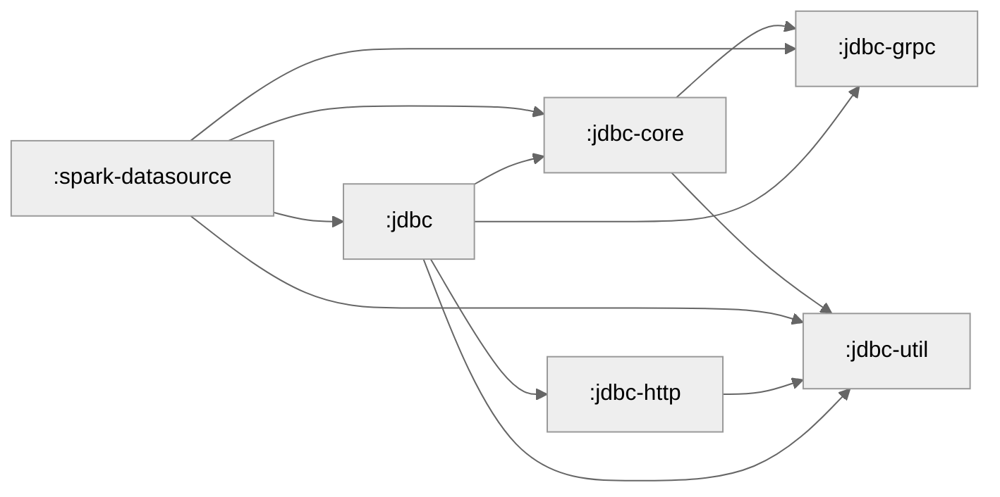

## Coverage

Run `./gradlew clean build testCodeCoverageReport` to build the coverage report in `build/reports/jacoco/testCodeCoverageReport/html/index.html`.

There will also be an accompanying CSV in `build/reports/jacoco/testCodeCoverageReport/testCodeCoverageReport.csv` and a xml file in `build/reports/jacoco/testCodeCoverageReport/testCodeCoverageReport.xml` to be consumed by other tools.

## Module Graph

Above graph is generated based on the gradle build files.
It can be regenerated using `./gradlew createModuleGraph`.