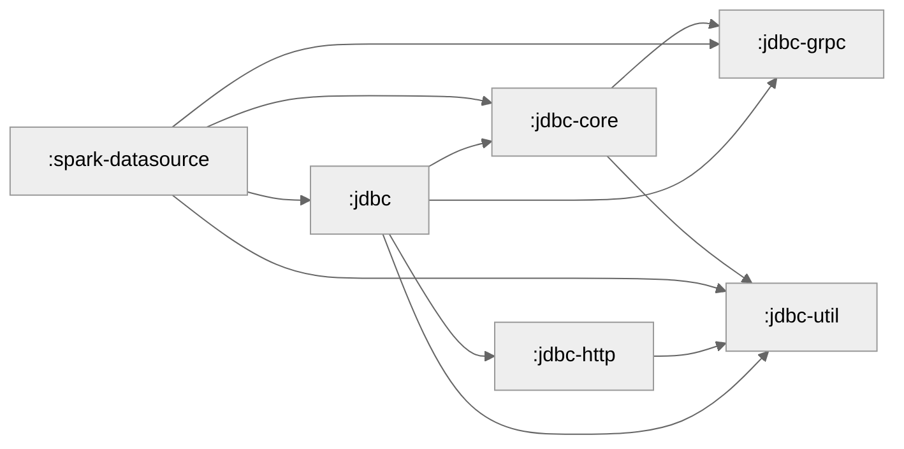

## Development Guidelines

### Best Practices

#### Working with Streams and Iterators

**FluentIterable** from Google Guava is the established reference interface for operating on iterator and stream-like data structures in this codebase. It provides a fluent API for transforming, filtering, and manipulating collections in a functional programming style.

While we also considered the Java Streams API, we discourage its use because the `Spliterator` concept together with `tryAdvance` can sneakily lead to OOMs due to materializing full Iterators.

## Coverage

Run `./gradlew clean build testCodeCoverageReport` to build the coverage report in `build/reports/jacoco/testCodeCoverageReport/html/index.html`.

There will also be an accompanying CSV in `build/reports/jacoco/testCodeCoverageReport/testCodeCoverageReport.csv` and a xml file in `build/reports/jacoco/testCodeCoverageReport/testCodeCoverageReport.xml` to be consumed by other tools.

## Module Graph

Above graph is generated based on the gradle build files.
It can be regenerated using `./gradlew createModuleGraph`.