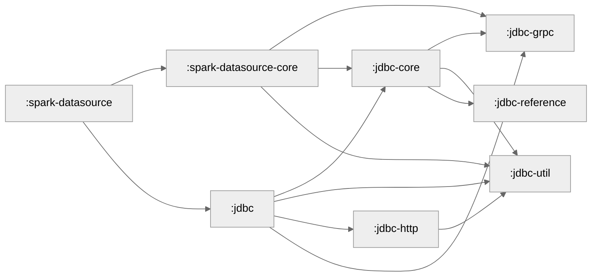

# Development

## Building from source code

Use the following command to build and test the driver:

```shell
./gradlew clean build
```

To inspect the jars that will be published run and take a look in `build/maven-repo`:

```shell
./gradlew build publishAllPublicationsToRootBuildDirRepository
```

## Coverage

Run `./gradlew clean build testCodeCoverageReport` to build the coverage report in `build/reports/jacoco/testCodeCoverageReport/html/index.html`.

There will also be an accompanying CSV in `build/reports/jacoco/testCodeCoverageReport/testCodeCoverageReport.csv` and a xml file in `build/reports/jacoco/testCodeCoverageReport/testCodeCoverageReport.xml` to be consumed by other tools.

## Maintenance

The following commands should be run regularly to ensure the project stays healthy
- `./gradlew createModuleGraph`, it updates the module graph in this document and should be run every time the inter project dependencies change
- `./gradlew versionCatalogUpdate`, should be run every time a dependency is added and regularly anyway to avoid vulnerable versions

## Best Practices

### Working with Streams and Iterators

**FluentIterable** from Google Guava is the established reference interface for operating on iterator and stream-like data structures in this codebase. It provides a fluent API for transforming, filtering, and manipulating collections in a functional programming style.

While we also considered the Java Streams API, we discourage its use because the `Spliterator` concept together with `tryAdvance` can sneakily lead to OOMs due to materializing full Iterators.

## Tech Debt

- Some of our classes are tested using assertions generated with [the assertj assertions generator][assertion generator]. Due to some transient test-compile issues we experienced, we checked in generated assertions for some of our classes. With the move to Gradle we lost the ability to update them and thus we should completely remove those files. To find these generated assertions, look for files with the path `**/test/**/*Assert.java`.
- The `Tracer` singleton is overengineered. We should directly merge its functionality with the `TracingHeadersInterceptor`.

# Advanced usage

The JDBC driver offers two JDBC drivers, for the `jdbc:salesforce-hyper:`
and `jdbc:salesforce-datacloud:` URLs.

The `salesforce-datacloud` driver is integrated with Data Cloud and is meant
to be used by end-users.

The `jdbc:salesforce-hyper` driver can be used to directly connect to a Hyper
server, independent of Data Cloud. This driver is used in most of the test cases
in this repository, which spin up a local, Data-Cloud-independent Hyper instance.

Both drivers support the following properties:

**Connection Properties:**
- `workload`: The workload to use for the connection (default: "jdbcv3")
- `externalClientContext`: The external client context to use for the connection (default: empty string)
- `queryTimeout`: The query timeout in seconds (default: 0, interpreted as infinite timeout)
- `queryTimeoutLocalEnforcementDelay`: Additional wait time for server-side cancellation in seconds (default: 5)
- `querySetting.<key>`: Query settings to pass to the server (e.g., `querySetting.maxMemory=1GB`)

**gRPC Channel Properties (unstable!):**
- `grpc.keepAlive`: Enable keep alive (default: false)
- `grpc.keepAlive.time`: Keep alive time in seconds
- `grpc.keepAlive.timeout`: Keep alive timeout in seconds
- `grpc.keepAlive.withoutCalls`: Keep alive without calls
- `grpc.idleTimeoutSeconds`: Idle timeout in seconds
- `grpc.enableRetries`: Enable retries (default: true)
- `grpc.retryPolicy.maxAttempts`: Maximum retry attempts
- `grpc.retryPolicy.initialBackoff`: Initial backoff duration
- `grpc.retryPolicy.maxBackoff`: Maximum backoff duration
- `grpc.retryPolicy.backoffMultiplier`: Backoff multiplier
- `grpc.retryPolicy.retryableStatusCodes`: Comma-separated list of retryable status codes (default: "UNAVAILABLE")

In addition, the `salesforce-datacloud` driver supports:

**Authentication Properties:**
- `clientId`: OAuth client ID (required)
- `clientSecret`: OAuth client secret (required for password and refresh token auth)
- `dataspace`: Data space identifier (optional)
- `userName`: Username for authentication (required for password auth and private key auth)
- `password`: Password for password authentication (required for password auth)
- `privateKey`: Private key in PEM format for JWT authentication (required for private key auth)
- `refreshToken`: Refresh token for token-based authentication (required for refresh token auth)

**HTTP Client Properties (unstable!):**
- `http.logging.level`: HTTP logging level - NONE, BASIC, HEADERS, BODY (default: BASIC)
- `http.disableSocksProxy`: Disable SOCKS proxy
- `http.userAgent`: Custom user agent string
- `http.readTimeOutSeconds`: Read timeout in seconds
- `http.connectTimeOutSeconds`: Connect timeout in seconds
- `http.callTimeOutSeconds`: Call timeout in seconds
- `http.cacheTtlMs`: Metadata cache TTL in milliseconds
- `http.maxRetries`: Maximum number of HTTP retries

Properties can be passed either as `java.util.Properties` or as part of the
JDBC URL. The JDBC URLs use the common search parameter encoding, e.g.
`jdbc:salesforce-datacloud:login.salesforce.com?user=foo&password=bar`.

Modern applications should use the `javax.sql.DataSource` interfaces instead
of `Driver.getConnection()` mechanism, though. For that purpose, we provide the
`DataCloudDatasource` and `HyperDatasource` classes through which connections
can be configured in a type-safe manner.

# Code design

## Module Graph

