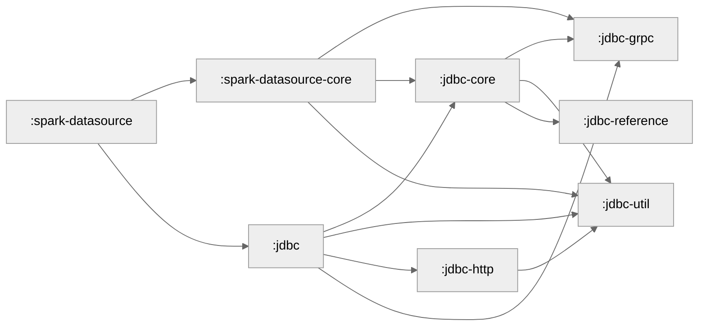

## Development Guidelines

### Best Practices

#### Working with Streams and Iterators

**FluentIterable** from Google Guava is the established reference interface for operating on iterator and stream-like data structures in this codebase. It provides a fluent API for transforming, filtering, and manipulating collections in a functional programming style.

While we also considered the Java Streams API, we discourage its use because the `Spliterator` concept together with `tryAdvance` can sneakily lead to OOMs due to materializing full Iterators.

## Coverage

Run `./gradlew clean build testCodeCoverageReport` to build the coverage report in `build/reports/jacoco/testCodeCoverageReport/html/index.html`.

There will also be an accompanying CSV in `build/reports/jacoco/testCodeCoverageReport/testCodeCoverageReport.csv` and a xml file in `build/reports/jacoco/testCodeCoverageReport/testCodeCoverageReport.xml` to be consumed by other tools.

## Maintenance

The following commands should be run regularly to ensure the project stays healthy
- `./gradlew createModuleGraph`, it updates the module graph in this document and should be run every time the inter project dependencies change
- `./gradlew versionCatalogUpdate`, should be run every time a dependency is added and regularly anyway to avoid vulnerable versions
## Tech Debt

- Some of our classes are tested using assertions generated with [the assertj assertions generator][assertion generator]. Due to some transient test-compile issues we experienced, we checked in generated assertions for some of our classes. With the move to Gradle we lost the ability to update them and thus we should completely remove those files. To find these generated assertions, look for files with the path `**/test/**/*Assert.java`.

## Module Graph

