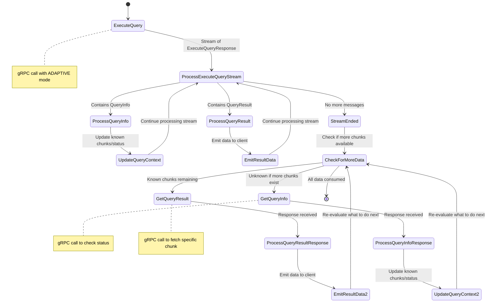

## Adaptive Query Pattern

This below diagram represents the `Adaptive` transfer mode flow which works in two phases:

**Initial Phase**: The `ExecuteQuery` call returns up to one result chunk synchronously along with query status information, allowing immediate data access while the query may still be running.

**Async Fetching Phase**: Once the initial stream ends, the machine decides between `GetQueryResult` (when it knows specific chunks are available) and `GetQueryInfo` (when it needs to check for newly available chunks). This avoids unnecessary polling while ensuring all data is eventually retrieved.

This approach provides faster time-to-first-result than pure async mode while avoiding the timeout risks of sync mode for large result sets. The entire state machine is exposed to client code as an `Iterator<QueryResult>`, where each call to `next()` may trigger state transitions and API calls as needed.

